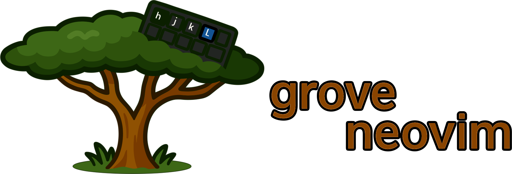

<!-- DOCGEN:OVERVIEW:START -->



Grove-nvim is a Neovim that provides a set of commands and workflows to interact with Grove tools, such as `grove-flow`. The plugin is designed to streamline AI-assisted development by connecting Neovim's text editing capabilities with Grove's plan management and code generation features.

<!-- placeholder for animated gif -->

## Key Features

-   **In-Editor AI Chat**: Run interactive AI chat sessions directly on the current buffer using the `:GroveChatRun` command. 

-   **Plan Management**: Interact with `grove-flow` plans through a UI integrated into Neovim.
    -   `:GrovePlan`: Opens an interactive picker to browse, preview, and manage existing plans.
    -   `:GrovePlanInit`: Initializes a new plan directory with guided prompts for configuration.
    -   `:GrovePlanExtract`: Creates a new plan by automatically extracting content from the current markdown buffer, using its frontmatter or filename to suggest a plan name.

-   **"Code-to-Chat" Workflow**: A structured process for using code snippets in AI conversations.
    -   `:GroveSetTarget`: Designates a markdown file as the "target" for the current session.
    -   `:'<,'>GroveTextRun`: Visually select a block of code, provide a prompt, and the plugin appends both to the target file. It then automatically runs a silent chat session on that file, allowing for a continuous and context-aware workflow for code analysis, refactoring, or documentation.

-   **Job Management**: Add jobs to plans using either a form-based UI (`:GroveAddJob`) for guided creation or a floating terminal TUI (`:GroveAddJobTUI`) for a more direct `flow` experience.

## How It Works

The plugin consists of two main components: a Lua plugin for Neovim and a Go command-line application named `neogrove`.

1.  **Lua Plugin (`lua/` files)**: This component runs inside Neovim. It defines user commands (e.g., `:GrovePlan`, `:GroveChatRun`) and keybindings. It is responsible for creating the user interface elements, such as input prompts and pickers, and managing editor state.

2.  **Go Binary (`neogrove`)**: When a user invokes a command, the Lua code executes the `neogrove` binary with appropriate arguments. This Go application serves as a stable interface and wrapper.

3.  **Flow Execution**: The `neogrove` binary constructs and executes commands for the `flow` tool from the `grove-flow` project. It pipes standard input, output, and error streams between the `flow` process and the Neovim terminal or background job, enabling interactive use.

### Installation

Install grove-nvim using the Grove meta-tool:
```bash
grove install grove-nvim
```

Then add to your Neovim configuration. For example, with lazy.nvim:
```lua
{ "mattsolo1/grove-nvim" }
```

Grove-nvim requires the Grove ecosystem. See the [Grove Installation Guide](https://github.com/mattsolo1/grove-meta/blob/main/docs/02-installation.md) for setup instructions.

<!-- DOCGEN:OVERVIEW:END -->


<!-- DOCGEN:TOC:START -->

See the [documentation](docs/) for detailed usage instructions:
- [Overview](docs/01-overview.md)
- [Configuration](docs/02-configuration.md)
- [Examples](docs/03-examples.md)

<!-- DOCGEN:TOC:END -->
